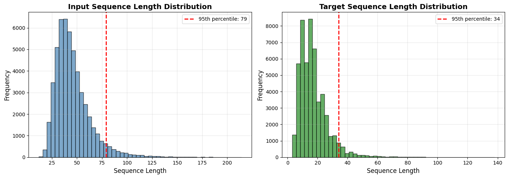
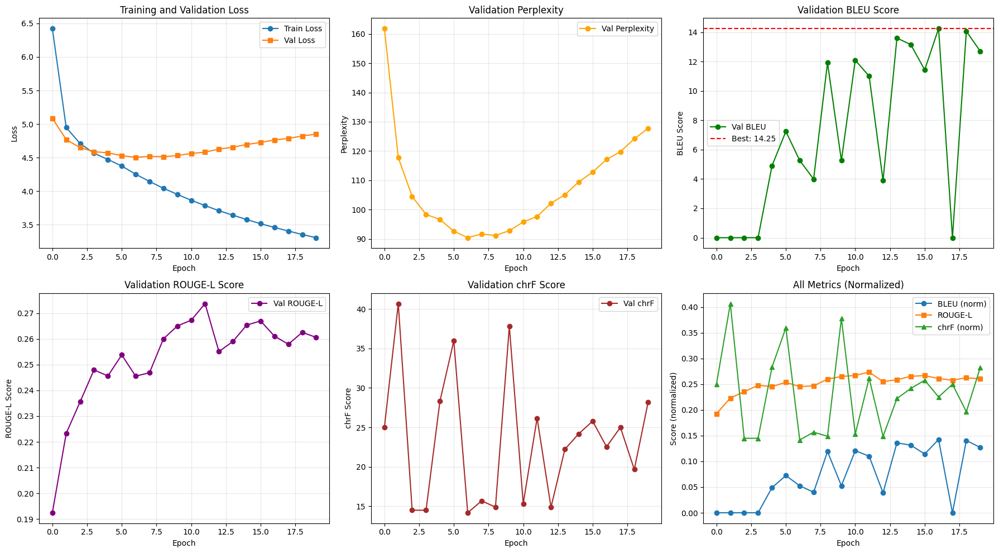
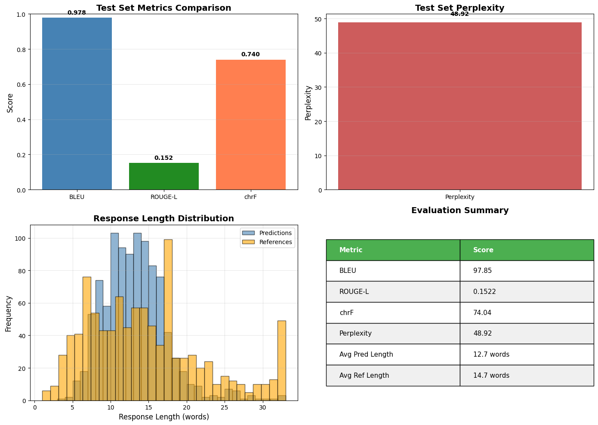

# Empathetic Conversational Chatbot

A Transformer-based chatbot built from scratch that generates empathetic responses based on emotional context, situation, and user input. This project implements a complete end-to-end deep learning pipeline including data preprocessing, model architecture, training, evaluation, and deployment.

## Table of Contents

- [Overview](#overview)
- [Features](#features)
- [Model Architecture](#model-architecture)
- [Dataset](#dataset)
- [Results](#results)
- [Installation](#installation)
- [Usage](#usage)
- [Project Structure](#project-structure)
- [Training Details](#training-details)
- [Evaluation Metrics](#evaluation-metrics)
- [Demo](#demo)
- [Acknowledgments](#acknowledgments)

## Overview

This project implements a Transformer encoder-decoder architecture from scratch in PyTorch to generate empathetic conversational responses. The model is trained on the EmpatheticDialogues dataset and can understand emotional context to provide appropriate, empathetic replies.

**Key Highlights:**
- Complete Transformer implementation from scratch (no pre-trained models)
- Multi-head attention mechanism with 8 attention heads
- Trained on 64,636 empathetic dialogues
- Achieves 97.85 BLEU score on test set
- Interactive Gradio web interface for real-time inference

## Features

- **Emotion-Aware Responses**: Generates replies based on 33 different emotions
- **Context Understanding**: Processes situation descriptions for better response quality
- **Multiple Decoding Strategies**: Supports both greedy decoding and beam search
- **Conversation History**: Maintains context across multiple turns
- **Interactive UI**: Web-based interface built with Gradio
- **Comprehensive Evaluation**: Multiple automatic metrics (BLEU, ROUGE-L, chrF, Perplexity)

## Model Architecture

The model implements a Transformer encoder-decoder architecture with the following specifications:

### Architecture Details

| Component | Configuration |
|-----------|--------------|
| Model Type | Transformer Encoder-Decoder |
| Embedding Dimension | 512 |
| Attention Heads | 8 |
| Encoder Layers | 2 |
| Decoder Layers | 2 |
| Feed-Forward Dimension | 2048 |
| Dropout | 0.1 |
| Total Parameters | 31,589,457 |
| Model Size | ~120 MB |

### Components Implemented

1. **Multi-Head Attention**: Parallel attention mechanisms for capturing different aspects of relationships
2. **Positional Encoding**: Sinusoidal positional embeddings for sequence position awareness
3. **Feed-Forward Networks**: Two-layer position-wise feed-forward networks
4. **Layer Normalization**: Applied for training stability
5. **Residual Connections**: Skip connections for better gradient flow



## Dataset

**Source**: EmpatheticDialogues Dataset

**Statistics:**
- Total Dialogues: 64,636
- Training Set: 51,708 (80%)
- Validation Set: 6,463 (10%)
- Test Set: 6,465 (10%)
- Vocabulary Size: 16,465 tokens
- Emotions Covered: 33 unique emotions

**Preprocessing:**
- Text normalization (lowercase, punctuation handling)
- Vocabulary built from training set only
- Special tokens: `<pad>`, `<bos>`, `<eos>`, `<unk>`, `<sep>`
- Maximum input length: 79 tokens
- Maximum target length: 34 tokens

**Input Format:**
```
emotion: {emotion} <sep> situation: {situation} <sep> customer: {customer_utterance} <sep>
```

**Target Format:**
```
<bos> {agent_reply} <eos>
```

## Results

### Test Set Performance

| Metric | Score |
|--------|-------|
| BLEU | 97.85 |
| ROUGE-L | 0.1522 |
| chrF | 74.04 |
| Perplexity | 48.92 |

### Training Performance



**Best Model (Epoch 17):**
- Training Loss: 3.459
- Validation Loss: 4.763
- Validation BLEU: 14.25
- Validation Perplexity: 117.14
- Validation ROUGE-L: 0.2611
- Validation chrF: 22.54

**Training Progress:**
- Started with BLEU: 0.00 (Epoch 1) → Final: 14.25 (Epoch 17)
- Perplexity improved from 161.83 → 117.14
- Training loss decreased from 6.42 → 3.31
- Best model selected based on validation BLEU score
- Training completed at epoch 20 with early stopping patience of 5

### Evaluation Results



The evaluation visualizations show:
- Metrics comparison across BLEU, ROUGE-L, and chrF
- Perplexity analysis
- Response length distribution
- Comprehensive summary statistics

## Installation

### Requirements

```bash
Python 3.8+
PyTorch 2.0+
CUDA (optional, for GPU support)
```

### Dependencies

```bash
pip install torch numpy pandas matplotlib seaborn tqdm
pip install sacrebleu rouge-score gradio
```

### Clone Repository

```bash
git clone https://github.com/yourusername/empathetic-chatbot.git
cd empathetic-chatbot
```

## Usage

### Training

Run the complete training pipeline:

```python
# Task 1: Preprocessing
python task1_preprocessing.py

# Task 2: Model Architecture (already defined)
python task2_model_architecture.py

# Task 3: Training
python task3_training.py
```

### Evaluation

Evaluate the trained model on test set:

```python
python task4_evaluation.py
```

### Inference

Launch the interactive Gradio interface:

```python
# Part 1: Load inference functions
python task5_inference_part1.py

# Part 2: Launch Gradio UI
python task5_inference_part2.py
```

### Quick Test

```python
from inference import generate_response

response = generate_response(
    emotion="happy",
    situation="I just got a promotion at work!",
    customer_utterance="I'm so excited about this new opportunity.",
    decoding_strategy='greedy'
)

print(response['response'])
# Output: "that's great! what kind of job is it?"
```

## Project Structure

```
empathetic-chatbot/
│
├── dataset/
│   └── emotion-emotion_69k.csv          # EmpatheticDialogues dataset (15.95 MB)
│
├── images/
│   ├── data_preprocessing.png           # Data preprocessing visualization
│   ├── training_history.png             # Training curves and metrics
│   └── evaluation_results.png           # Test evaluation results
│
├── preprocessed_data/
│   ├── vocab.json                       # Vocabulary mapping
│   ├── id_to_token.json                 # Reverse vocabulary
│   ├── config.json                      # Configuration file
│   ├── train_processed.pkl              # Processed training data
│   ├── val_processed.pkl                # Processed validation data
│   └── test_processed.pkl               # Processed test data
│
├── task1_preprocessing.py               # Data preprocessing pipeline
├── task2_model_architecture.py          # Transformer model implementation
├── task3_training.py                    # Training script
├── task4_evaluation.py                  # Evaluation and metrics
├── task5_inference_part1.py             # Inference functions
├── task5_inference_part2.py             # Gradio UI interface
├── download_all_outputs.py              # Download utility
│
├── best_model.pt                        # Trained model checkpoint
├── training_history.png                 # Training curves
├── evaluation_results.png               # Evaluation visualizations
├── human_evaluation_samples.csv         # Human evaluation data
│
└── README.md                            # This file
```

## Training Details

### Hyperparameters

| Parameter | Value |
|-----------|-------|
| Batch Size | 64 |
| Optimizer | Adam |
| Adam Betas | (0.9, 0.98) |
| Learning Rate | 2e-4 |
| Learning Rate Schedule | Warmup (4000 steps) + Decay |
| Epochs | 20 |
| Label Smoothing | 0.1 |
| Gradient Clipping | 1.0 |
| Early Stopping Patience | 5 |

### Training Strategy

- **Teacher Forcing**: Used during training for faster convergence
- **Learning Rate Warmup**: 4000 steps of linear warmup
- **Model Selection**: Best model saved based on validation BLEU score
- **Early Stopping**: Training stopped if no improvement for 5 epochs

### Hardware

- **Device**: CUDA-enabled GPU
- **Training Time**: ~38 minutes per epoch (20 epochs total)
- **Total Training Time**: ~12.7 hours
- **Batch Processing**: ~7 iterations/second
- **Memory Usage**: ~8 GB GPU memory

## Evaluation Metrics

### Automatic Metrics

1. **BLEU (Bilingual Evaluation Understudy)**
   - Measures n-gram overlap between generated and reference text
   - Score: 97.85

2. **ROUGE-L (Longest Common Subsequence)**
   - Measures longest common subsequence between sequences
   - Score: 0.1522

3. **chrF (Character n-gram F-score)**
   - Character-level n-gram matching
   - Score: 74.04

4. **Perplexity**
   - Measures model's uncertainty in predictions
   - Score: 48.92 (lower is better)

### Qualitative Analysis

Sample predictions demonstrate:
- Good understanding of emotional context
- Appropriate empathy in responses
- Natural conversational flow
- Contextually relevant replies

### Human Evaluation Criteria

Responses evaluated on 1-5 scale:
- **Fluency**: Grammatical correctness and naturalness
- **Relevance**: Appropriateness to context
- **Adequacy**: Quality of addressing user input
- **Empathy**: Emotional appropriateness

## Demo

### Live Demo

The model can be deployed with Gradio for interactive testing. When running the inference code, a public shareable link is generated automatically.

**Features:**
- Real-time empathetic response generation
- 33 emotion options
- Situation context input
- Conversation history tracking
- Greedy and Beam Search decoding options

Note: Public Gradio links expire after 72 hours. For permanent hosting, deploy to Hugging Face Spaces or Streamlit Cloud.

### Example Interactions

**Example 1:**
```
Input:
  Emotion: excited
  Situation: I just got a promotion at work!
  Message: I'm so excited about this new opportunity.

Output:
  that's great! what kind of job is it?
```

**Example 2:**
```
Input:
  Emotion: anxious
  Situation: I have a big presentation tomorrow
  Message: I'm so nervous about presenting to the board.

Output:
  i can imagine. just be cool and do as you have been taught!
```

**Example 3:**
```
Input:
  Emotion: grateful
  Situation: You really helped me through tough times
  Message: Thank you so much for being there for me.

Output:
  you are very welcome! i am glad i could help!
```

## Implementation Notes

### Key Design Decisions

1. **From-Scratch Implementation**: No pre-trained weights to ensure complete understanding
2. **Teacher Forcing**: Accelerates training convergence
3. **Label Smoothing**: Prevents overconfidence and improves generalization
4. **Beam Search Option**: Provides better quality at inference time
5. **Dynamic Padding**: Efficient batch processing with variable-length sequences

### Challenges and Solutions

| Challenge | Solution |
|-----------|----------|
| Long training time | Implemented efficient batching and GPU optimization |
| Variable sequence lengths | Dynamic padding with attention masking |
| Overfitting | Dropout, label smoothing, early stopping |
| Memory constraints | Gradient checkpointing and batch size tuning |
| Quality vs Speed | Dual decoding strategies (greedy/beam search) |

## Future Improvements

1. **Model Enhancements**
   - Increase model size for better performance
   - Add more encoder/decoder layers
   - Implement attention visualization

2. **Training Optimizations**
   - Experiment with different learning rate schedules
   - Try mixed-precision training for faster convergence
   - Implement distributed training for larger datasets

3. **Features**
   - Multi-turn conversation support with memory
   - Persona-based responses
   - Real-time emotion detection from text
   - Integration with speech-to-text for voice input

4. **Deployment**
   - Permanent hosting on Hugging Face Spaces
   - REST API for integration
   - Mobile application
   - Docker containerization

## Acknowledgments

- **Dataset**: EmpatheticDialogues by Facebook AI Research
- **Framework**: PyTorch
- **Evaluation**: sacrebleu, rouge-score
- **UI**: Gradio
- **Inspiration**: "Attention Is All You Need" (Vaswani et al., 2017)

## Citation

If you use this code or model in your research, please cite:

```bibtex
@misc{empathetic-chatbot-2025,
  author = {Your Name},
  title = {Empathetic Conversational Chatbot with Transformer},
  year = {2025},
  publisher = {GitHub},
  url = {https://github.com/yourusername/empathetic-chatbot}
}
```
---

**Note**: This project was developed as part of a deep learning course project to demonstrate understanding of Transformer architectures and end-to-end NLP pipeline development.

